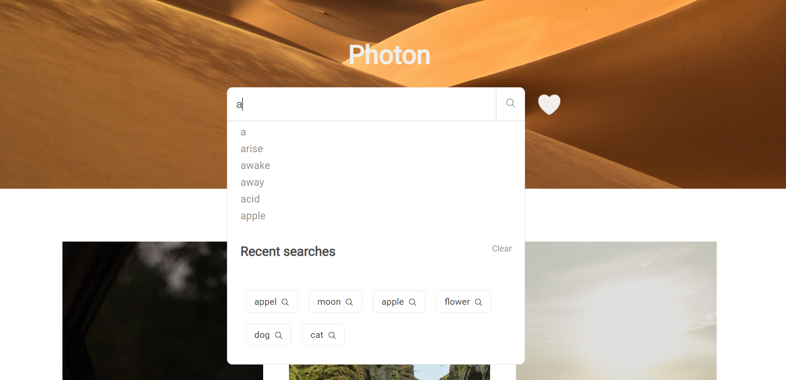

# Photon

## Page View



---

## How does Photon be used?

 Photon is a provider of stock phography.

* In this project [Pexels API](https://www.pexels.com/api/) is used for images and [Datamuse API](https://www.datamuse.com/api/) is used for words.


---

*When the user searches from the search engine, suggest words dropdown in the search engine.

*User can see her past searches in the dropdown menu.

*User can delete the past if she/he wants.

*After searching, at the bottom of the search engine, words with similar meanings to the searched word appear on the recommendation, when clicked, a search is made for that word.


---

*By clicking on the photographer's name on the photos, User can access the photos of that photographer.

*By clicking the hearts on the photos User can liked them and can collect them on a page. To access the photos, simply User can click on the heart next to the search engine.

*You can zoom in by clicking on the picture.

*More images can be uploaded with the more button

---

## ES6 + Features

* Arrow Functions
* async/await with try/catch
* Modules export/import
* localStorage

---

## Structure

```
├── images
│   ├── ph1.png
│   └── ph2.png
│
├── public
│   └── style.css
├── src
│   ├── page 
│   │     ├── fetchApi.js
│   │     ├── autocomplete.js
│   │     ├── heartedPhotos.js
│   │     ├── photographer.js
│   │     ├── relatedWords.js
│   │     ├── currentWeather.js
│   │     └── searched.js
│   └── view
│        └──generatePicture.js
│  
├── app.js
├── index.html
└── README.md

```

---

## Note

 The browser prevents downloading anything from different servers' APIs for security reasons. Pexels API was used to create this project, in this case Photos cannot be downloaded_ 🥹
